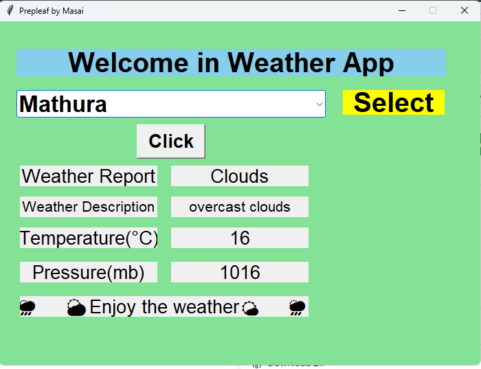

# Weather Python GUI App

This Weather Python GUI (Graphical User Interface) App provides a convenient way to access weather information using Python. With this application, users can easily retrieve current weather conditions, forecasts, and more, all presented in a user-friendly graphical interface.

## Features

- **Current Weather**: View real-time weather data for a specified location, including temperature, humidity, wind speed, and more.

- **Weather Forecast**: Get a forecast for the upcoming days to plan ahead, with details on expected temperature ranges, precipitation, and wind conditions.

- **User-Friendly Interface**: The GUI makes it easy to input location details and navigate through weather information.

- **Customization Options**: Users can customize the app to suit their preferences, such as choosing between metric and imperial units for temperature and wind speed.

- **Responsive Design**: The app is designed to be responsive and adaptable to different screen sizes and resolutions.

- **Simple Installation**: Easy installation process with minimal dependencies, allowing users to get started quickly.

## Installation

To install the Weather Python GUI App, follow these steps:

1. Clone the repository to your local machine:

   
   ```
        git clone https://github.com/SangeetaSharma73/GitWeatherApp.git
   ``` 

2.Navigate to the project directory:
    
    ```
        cd GITWEATHERAPP
    ```    

3.Install the required module:
    
    ```
        pip install random 
    ```
    ```
        pip install tkinter
    ```
    ```
        pip install request
    ```
    ```
        pip install json
    ```
4.Run the application:
    
    ```
        python Weather.py
    ```
**Usage**

Launch the application by running Weather.py.
Enter the name of the city or location for which you want to check the weather.
Click on the "Get Weather" button.
The application will display the current weather conditions and forecast for the specified location.



**Contributing**

Contributions are welcome! If you would like to contribute to the Weather Python GUI App, please follow these guidelines:

**Fork the repository**

Create a new branch for your feature or bug fix.
Make your changes and ensure the code passes any existing tests.
Test the application thoroughly.
Submit a pull request with a clear description of your changes.

**Contact**

If you have any questions, suggestions, or issues regarding the Weather Python GUI App, feel free to contact us at sangeeta136428sharma@gmail.com. We appreciate your feedback!
